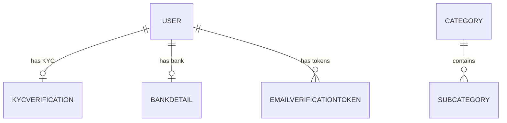
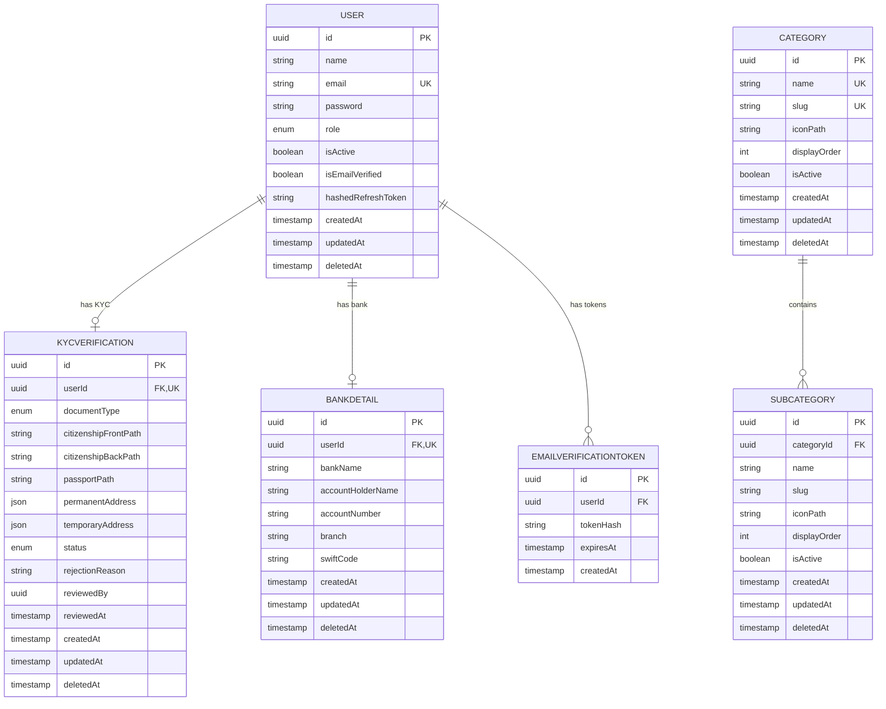

# Database Schema

> This file is auto-maintained. It must be updated alongside every entity or schema change.
> See [Rule 12: Database Schema Maintenance](.agents/rules/rule-12-database-schema-maintenance.md).

_Last updated: 2026-04-29 by agent_

---

## High-Level Relationships

---

## Full Entity Relationship Diagram

---

## Entity Notes

### USER
- `password` is bcrypt-hashed before persistence — never store or log plaintext.
- `hashedRefreshToken` stores a bcrypt hash of the refresh token, not the raw token. Set to `null` on logout.
- `role` enum values: `SUPERADMIN`, `ADMIN`, `USER`. Default: `USER`.
- `isActive` soft-disables the account without deletion. Checked on every authenticated request.
- `deletedAt` enables TypeORM soft-delete via `@DeleteDateColumn`. Queries exclude soft-deleted rows by default.

### EMAILVERIFICATIONTOKEN
- Does **not** extend `BaseEntity` — has its own minimal schema (no `updatedAt`, no `deletedAt`).
- `tokenHash` stores the **SHA-256 hash** of the raw token only. The raw token is sent by email and never persisted.
- Tokens expire after **24 hours** (`expiresAt`) and are deleted immediately after a successful verification (single-use).
- `userId` is indexed for fast lookup but is not a TypeORM-defined `@ManyToOne` relation — it is a plain UUID column referencing `users.id`.

### KYCVERIFICATION
- `userId` is both a foreign key and unique — enforces one KYC record per user.
- `documentType` enum values: `CITIZENSHIP`, `PASSPORT`.
- `status` enum values: `PENDING`, `APPROVED`, `REJECTED`. Default: `PENDING`.
- `permanentAddress` and `temporaryAddress` are `jsonb` columns with shape `{ street, city, district, province, country }`.
- `reviewedBy` is a UUID referencing `users.id` (the admin who reviewed) — stored as a plain column, no TypeORM relation defined.
- `deletedAt` soft-delete inherited from `BaseEntity`.

### BANKDETAIL
- `userId` is both a foreign key and unique — enforces one bank detail record per user.
- `accountNumber`, `branch`, and `swiftCode` are **AES-256-GCM encrypted** at the application layer before being written to the database. The stored values are ciphertext.
- `swiftCode` is nullable (not all banks require it).
- `deletedAt` soft-delete inherited from `BaseEntity`.

### CATEGORY
- `name` and `slug` are both globally unique across all categories.
- `slug` is auto-generated from `name` at creation time and is immutable after creation.
- `iconPath` stores the relative path to the icon file under `/public/category-icons/`.
- `displayOrder` controls the sort order in category listings (ascending).
- `isActive` soft-disables the category without deletion. Categories with active subcategories cannot be deleted.
- `deletedAt` soft-delete inherited from `BaseEntity`.

### SUBCATEGORY
- `categoryId` + `slug` has a **composite unique index** — slug must be unique within its parent category only (not globally).
- `slug` is auto-generated from `name` at creation time.
- `iconPath` stores the relative path to the icon file under `/public/category-icons/`.
- `displayOrder` controls sort order within the parent category.
- `isActive` soft-disables the subcategory without deletion.
- `deletedAt` soft-delete inherited from `BaseEntity`.
