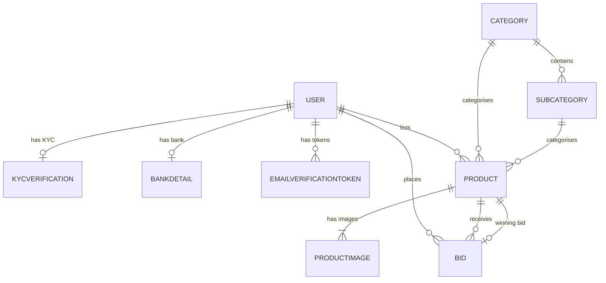
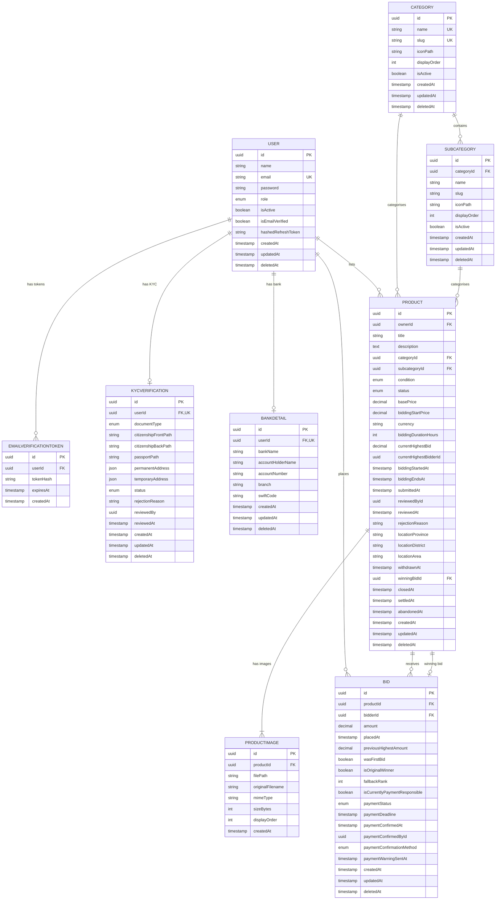

# Database Schema

> This file is auto-maintained. It must be updated alongside every entity or schema change.
> See [Rule 12: Database Schema Maintenance](.agents/rules/rule-12-database-schema-maintenance.md).

_Last updated: 2026-05-11 by agent (Bidding module added — Bid entity, Product auction outcome fields)_

---

## High-Level Relationships

---

## Full Entity Relationship Diagram

---

## Entity Notes

### USER
- `password` is bcrypt-hashed before persistence — never store or log plaintext.
- `hashedRefreshToken` stores a bcrypt hash of the refresh token, not the raw token. Set to `null` on logout.
- `role` enum values: `SUPERADMIN`, `ADMIN`, `USER`. Default: `USER`.
- `isActive` soft-disables the account without deletion. Checked on every authenticated request.
- `deletedAt` enables TypeORM soft-delete via `@DeleteDateColumn`. Queries exclude soft-deleted rows by default.

### EMAILVERIFICATIONTOKEN
- Does **not** extend `BaseEntity` — has its own minimal schema (no `updatedAt`, no `deletedAt`).
- `tokenHash` stores the **SHA-256 hash** of the raw token only. The raw token is sent by email and never persisted.
- Tokens expire after **24 hours** (`expiresAt`) and are deleted immediately after a successful verification (single-use).
- `userId` is indexed for fast lookup but is not a TypeORM-defined `@ManyToOne` relation — it is a plain UUID column referencing `users.id`.

### KYCVERIFICATION
- `userId` is both a foreign key and unique — enforces one KYC record per user.
- `documentType` enum values: `CITIZENSHIP`, `PASSPORT`.
- `status` enum values: `PENDING`, `APPROVED`, `REJECTED`. Default: `PENDING`.
- `permanentAddress` and `temporaryAddress` are `jsonb` columns with shape `{ street, city, district, province, country }`.
- `reviewedBy` is a UUID referencing `users.id` (the admin who reviewed) — stored as a plain column, no TypeORM relation defined.
- `deletedAt` soft-delete inherited from `BaseEntity`.

### BANKDETAIL
- `userId` is both a foreign key and unique — enforces one bank detail record per user.
- `accountNumber`, `branch`, and `swiftCode` are **AES-256-GCM encrypted** at the application layer before being written to the database. The stored values are ciphertext.
- `swiftCode` is nullable (not all banks require it).
- `deletedAt` soft-delete inherited from `BaseEntity`.

### CATEGORY
- `name` and `slug` are both globally unique across all categories.
- `slug` is auto-generated from `name` at creation time and is immutable after creation.
- `iconPath` stores the relative path to the icon file under `/public/category-icons/`.
- `displayOrder` controls the sort order in category listings (ascending).
- `isActive` soft-disables the category without deletion. Categories with active subcategories cannot be deleted.
- `deletedAt` soft-delete inherited from `BaseEntity`.

### SUBCATEGORY
- `categoryId` + `slug` has a **composite unique index** — slug must be unique within its parent category only (not globally).
- `slug` is auto-generated from `name` at creation time.
- `iconPath` stores the relative path to the icon file under `/public/category-icons/`.
- `displayOrder` controls sort order within the parent category.
- `isActive` soft-disables the subcategory without deletion.
- `deletedAt` soft-delete inherited from `BaseEntity`.

### PRODUCT
- `ownerId` references `users.id` — stored as a plain UUID column (no TypeORM `@ManyToOne` relation defined to avoid joins on every load).
- `condition` enum values: `NEW`, `LIKE_NEW`, `USED_GOOD`, `USED_FAIR`, `FOR_PARTS`.
- `status` enum values: `DRAFT`, `SUBMITTED`, `REJECTED`, `APPROVED`, `PENDING`, `ACTIVE`, `CLOSED`, `AWAITING_PAYMENT`, `SETTLED`, `PAYMENT_FAILED`, `ABANDONED`, `WITHDRAWN`. Default: `DRAFT`. See Rule 13 for full state machine.
- `basePrice` is the user-entered desired price. `biddingStartPrice` is auto-computed as `basePrice * 1.10` and stored so the bidding module never recomputes it.
- `biddingDurationHours` — countdown duration (hours) after the first bid is placed; configurable per product, default 72.
- `currentHighestBid`, `currentHighestBidderId`, `biddingStartedAt`, `biddingEndsAt` — null until the first bid is placed.
- `winningBidId` — references the `bids.id` of the bid that is currently payment-responsible (set when auction closes to `AWAITING_PAYMENT`) or the bid that led to `SETTLED`. Nullable; plain UUID column, no TypeORM relation.
- `closedAt` — timestamp when the auction timer expired and the product transitioned to `AWAITING_PAYMENT`.
- `settledAt` — timestamp when payment was confirmed and the product transitioned to `SETTLED`.
- `abandonedAt` — timestamp when all bidders in the fallback chain failed to pay and the product transitioned to `ABANDONED`.
- `reviewedById` references `users.id` (the admin who reviewed) — plain UUID column, no TypeORM relation.
- `locationProvince`, `locationDistrict`, `locationArea` — nullable, reserved for future location-based filtering.
- Composite indexes: `(status, createdAt)` for public listing, `(ownerId, status)` for "my products" queries, `(categoryId, subcategoryId)` for filters.
- `deletedAt` soft-delete inherited from `BaseEntity`.

### BID
- `productId` and `bidderId` are foreign keys stored as plain UUID columns with individual `@Index` decorators; TypeORM `@ManyToOne` relations are declared for `product` and `bidder` to enable JOIN-based queries.
- `amount` and `previousHighestAmount` are stored as `decimal(12,2)`. All monetary arithmetic in the service layer uses `decimal.js` — never JavaScript floats.
- `previousHighestAmount` — snapshot of `product.currentHighestBid` at the moment this bid was placed. `null` for the very first bid.
- `wasFirstBid` — true if this bid triggered the `PENDING → ACTIVE` product transition.
- `isOriginalWinner` — set to `true` on the highest bid when the auction closes; false for all other bids.
- `fallbackRank` — position in the payment fallback chain: `0` = original winner, `1` = first fallback, `2` = second fallback, etc.
- `isCurrentlyPaymentResponsible` — only ONE bid per product may have this `true` at any time. Enforced by a **partial unique index** on `(productId) WHERE "isCurrentlyPaymentResponsible" = true`.
- `paymentStatus` enum values: `NOT_RESPONSIBLE` (default), `PENDING`, `CONFIRMED`, `EXPIRED`. See Rule 14 for the full payment state machine.
- `paymentDeadline` — only meaningful when `isCurrentlyPaymentResponsible = true`. Set to `now + PAYMENT_WINDOW_HOURS` when a bid becomes responsible.
- `paymentWarningSentAt` — set once when the ~2-hour warning email is dispatched. Prevents duplicate warning emails on subsequent cron runs; never reset once set.
- `paymentConfirmedById` — UUID of the admin who manually confirmed payment (plain column, no TypeORM relation).
- `paymentConfirmationMethod` enum values: `ADMIN_MANUAL`, `BANK_API`.
- Composite indexes: `(productId, amount)` for highest-bid lookup, `(bidderId, placedAt)` for "my bids" queries, `(paymentStatus, paymentDeadline)` for overdue payment cron, `(productId, fallbackRank)` for fallback chain promotion.
- `deletedAt` soft-delete inherited from `BaseEntity`.

### PRODUCTIMAGE
- `productId` is a foreign key with `ON DELETE CASCADE` — images are hard-deleted when their product is hard-deleted.
- `(productId, displayOrder)` has a **composite unique constraint** — each display position is unique per product.
- `displayOrder: 0` designates the primary/thumbnail image.
- `filePath` stores the relative path on disk under `UPLOAD_BASE_DIR/products/:productId/`.
- Does **not** extend `BaseEntity` — has its own minimal schema (no `updatedAt`, no `deletedAt`).
