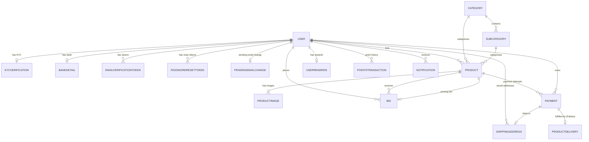
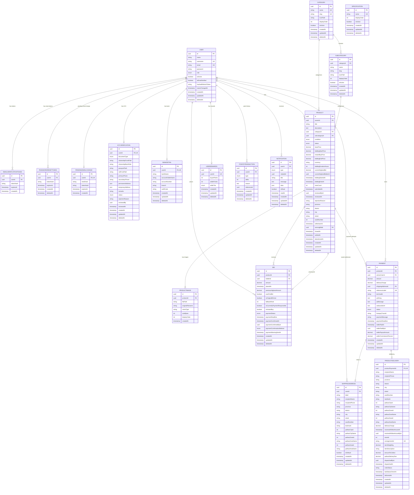

# Database Schema

> This file is auto-maintained. It must be updated alongside every entity or schema change.
> See [Rule 12: Database Schema Maintenance](.agents/rules/rule-12-database-schema-maintenance.md).

_Last updated: 2026-09-23 by agent (Pathao courier integration: documented previously-missing `SHIPPINGADDRESS`, added `PRODUCTDELIVERY`; `PAYMENT` loses `deliveryZone`, gains `shippingAddressId`, and `deliveryCharge` is now bundled into the Fonepay QR amount instead of collected as cash on delivery)_

---

## High-Level Relationships

```mermaid
erDiagram
    USER ||--o| KYCVERIFICATION : "has KYC"
    USER ||--o| BANKDETAIL : "has bank"
    USER ||--o{ EMAILVERIFICATIONTOKEN : "has tokens"
    USER ||--o{ PASSWORDRESETTOKEN : "has reset tokens"
    USER ||--o| PENDINGEMAILCHANGE : "pending email change"
    USER ||--o{ PRODUCT : "lists"
    CATEGORY ||--o{ SUBCATEGORY : "contains"
    CATEGORY ||--o{ PRODUCT : "categorises"
    SUBCATEGORY ||--o{ PRODUCT : "categorises"
    PRODUCT ||--|{ PRODUCTIMAGE : "has images"
    USER ||--o{ BID : places
    PRODUCT ||--o{ BID : receives
    PRODUCT ||--o| BID : "winning bid"
    PRODUCT ||--o{ PAYMENT : "payment attempts"
    USER ||--o{ PAYMENT : "owes"
    USER ||--o{ SHIPPINGADDRESS : "saved addresses"
    PAYMENT ||--o| SHIPPINGADDRESS : "ships to"
    PAYMENT ||--o| PRODUCTDELIVERY : "fulfilled by (Pathao)"
    USER ||--o| USERREWARDS : "has rewards"
    USER ||--o{ POINTSTRANSACTION : "point history"
    USER ||--o{ NOTIFICATION : "receives"
```

---

## Full Entity Relationship Diagram

```mermaid
erDiagram
    USER {
        uuid id PK
        string name
        string username UK
        string email UK
        string password
        enum role
        boolean isActive
        boolean isEmailVerified
        string hashedRefreshToken
        timestamp nameChangedAt
        timestamp createdAt
        timestamp updatedAt
        timestamp deletedAt
    }

    EMAILVERIFICATIONTOKEN {
        uuid id PK
        uuid userId FK
        string tokenHash
        timestamp expiresAt
        timestamp createdAt
    }

    PASSWORDRESETTOKEN {
        uuid id PK
        uuid userId FK
        string tokenHash
        timestamp expiresAt
        timestamp createdAt
        timestamp deletedAt
    }

    PENDINGEMAILCHANGE {
        uuid id PK
        uuid userId FK,UK
        string newEmail
        string tokenHash
        timestamp expiresAt
        timestamp createdAt
    }

    KYCVERIFICATION {
        uuid id PK
        uuid userId FK,UK
        enum documentType
        string citizenshipFrontPath
        string citizenshipBackPath
        string passportPath
        string nidFrontPath
        string primaryPhone
        string secondaryPhone
        json permanentAddress
        json temporaryAddress
        string remarks
        enum status
        string rejectionReason
        uuid reviewedBy
        timestamp reviewedAt
        timestamp createdAt
        timestamp updatedAt
        timestamp deletedAt
    }

    BANKDETAIL {
        uuid id PK
        uuid userId FK,UK
        string bankName
        string accountHolderName
        string accountNumber
        string branch
        string swiftCode
        timestamp createdAt
        timestamp updatedAt
        timestamp deletedAt
    }

    CATEGORY {
        uuid id PK
        string name UK
        string slug UK
        string iconPath
        int displayOrder
        boolean isActive
        timestamp createdAt
        timestamp updatedAt
        timestamp deletedAt
    }

    SUBCATEGORY {
        uuid id PK
        uuid categoryId FK
        string name
        string slug
        string iconPath
        int displayOrder
        boolean isActive
        timestamp createdAt
        timestamp updatedAt
        timestamp deletedAt
    }

    SPECIFICATION {
        uuid id PK
        string name UK
        int displayOrder
        boolean isActive
        timestamp createdAt
        timestamp updatedAt
        timestamp deletedAt
    }

    PRODUCT {
        uuid id PK
        uuid ownerId FK
        string title
        text description
        uuid categoryId FK
        uuid subcategoryId FK
        enum condition
        enum status
        decimal basePrice
        decimal biddingStartPrice
        decimal instantBuyPrice
        decimal biddingEndPrice
        string currency
        int biddingDurationHours
        decimal currentHighestBid
        uuid currentHighestBidderId
        timestamp biddingStartedAt
        timestamp biddingEndsAt
        int viewCount
        timestamp submittedAt
        uuid reviewedById
        timestamp reviewedAt
        string rejectionReason
        string province
        string district
        string city
        string street
        int wardNumber
        timestamp withdrawnAt
        uuid winningBidId FK
        timestamp closedAt
        timestamp settledAt
        timestamp abandonedAt
        timestamp createdAt
        timestamp updatedAt
        timestamp deletedAt
    }

    PRODUCTIMAGE {
        uuid id PK
        uuid productId FK
        string filePath
        string originalFilename
        string mimeType
        int sizeBytes
        int displayOrder
        timestamp createdAt
    }

    BID {
        uuid id PK
        uuid productId FK
        uuid bidderId FK
        decimal amount
        timestamp placedAt
        decimal previousHighestAmount
        boolean wasFirstBid
        boolean isOriginalWinner
        int fallbackRank
        boolean isCurrentlyPaymentResponsible
        boolean isInstantBuy
        enum paymentStatus
        timestamp paymentDeadline
        timestamp paymentConfirmedAt
        uuid paymentConfirmedById
        enum paymentConfirmationMethod
        timestamp paymentWarningSentAt
        timestamp createdAt
        timestamp updatedAt
        timestamp deletedAt
    }

    USER ||--o| KYCVERIFICATION : "has KYC"
    USER ||--o| BANKDETAIL : "has bank"
    USER ||--o{ EMAILVERIFICATIONTOKEN : "has tokens"
    USER ||--o{ PASSWORDRESETTOKEN : "has reset tokens"
    USER ||--o| PENDINGEMAILCHANGE : "pending email change"
    USER ||--o{ PRODUCT : "lists"
    CATEGORY ||--o{ SUBCATEGORY : "contains"
    CATEGORY ||--o{ PRODUCT : "categorises"
    SUBCATEGORY ||--o{ PRODUCT : "categorises"
    PRODUCT ||--|{ PRODUCTIMAGE : "has images"
    USER ||--o{ BID : places
    PRODUCT ||--o{ BID : receives
    PRODUCT ||--o| BID : "winning bid"
    PRODUCT ||--o{ PAYMENT : "payment attempts"
    USER ||--o{ PAYMENT : "owes"

    PAYMENT {
        uuid id PK
        uuid productId FK
        uuid winnerUserId FK
        decimal amount
        decimal deliveryCharge
        uuid shippingAddressId FK
        string referenceLabel UK
        string terminalId
        text qrString
        text qrMessage
        text websocketUrl
        enum status
        string fonepayTraceId
        string paymentMessage
        timestamp paymentDeadline
        timestamp sellerPaidAt
        uuid sellerPaidById
        decimal sellerPayoutAmount
        decimal sellerCommissionPercent
        timestamp createdAt
        timestamp updatedAt
        timestamp deletedAt
    }

    USER ||--o{ SHIPPINGADDRESS : "saved addresses"
    PAYMENT ||--o| SHIPPINGADDRESS : "ships to"
    PAYMENT ||--o| PRODUCTDELIVERY : "fulfilled by"

    SHIPPINGADDRESS {
        uuid id PK
        uuid userId FK
        string label
        string recipientName
        string recipientPhone
        string province
        string district
        string city
        string street
        string wardNumber
        string landmark
        int pathaoCityId
        string pathaoCityName
        int pathaoZoneId
        string pathaoZoneName
        int pathaoAreaId
        string pathaoAreaName
        boolean isDefault
        timestamp createdAt
        timestamp updatedAt
        timestamp deletedAt
    }

    PRODUCTDELIVERY {
        uuid id PK
        uuid productPaymentId FK, UK
        string recipientName
        string recipientPhone
        string province
        string district
        string city
        string street
        string wardNumber
        string landmark
        int pathaoCityId
        string pathaoCityName
        int pathaoZoneId
        string pathaoZoneName
        int pathaoAreaId
        string pathaoAreaName
        decimal deliveryCharge
        timestamp receivedAtWarehouseAt
        uuid receivedAtWarehouseById
        int storeId
        string consignmentId UK
        decimal itemWeightKg
        string itemDescription
        decimal amountToCollect
        decimal pathaoDeliveryFee
        uuid dispatchedById
        timestamp dispatchedAt
        string orderStatus
        timestamp lastStatusCheckAt
        timestamp deliveredAt
        timestamp createdAt
        timestamp updatedAt
        timestamp deletedAt
    }

    USER ||--o| USERREWARDS : "has rewards"
    USER ||--o{ POINTSTRANSACTION : "point history"

    USERREWARDS {
        uuid id PK
        uuid userId UK
        int buyerPoints
        int sellerPoints
        enum sellerTier
        timestamp createdAt
        timestamp updatedAt
        timestamp deletedAt
    }

    POINTSTRANSACTION {
        uuid id PK
        uuid userId FK
        enum type
        int delta
        text reason
        uuid referenceId
        timestamp createdAt
        timestamp updatedAt
        timestamp deletedAt
    }

    USER ||--o{ NOTIFICATION : "receives"

    NOTIFICATION {
        uuid id PK
        uuid userId FK
        enum type
        uuid relatedId
        string title
        text message
        json data
        boolean isRead
        timestamp readAt
        timestamp createdAt
        timestamp updatedAt
        timestamp deletedAt
    }
```

---

## Entity Notes

### USER
- `password` is bcrypt-hashed before persistence — never store or log plaintext.
- `hashedRefreshToken` stores a bcrypt hash of the refresh token, not the raw token. Set to `null` on logout.
- `role` enum values: `SUPERADMIN`, `ADMIN`, `USER`. Default: `USER`.
- `isActive` soft-disables the account without deletion. Checked on every authenticated request.
- `nameChangedAt` is `null` until the user exercises their one-time display-name change. Once set it cannot be cleared except by a SUPERADMIN via `POST /admin/users/:id/reset-name-change`.
- `username` is the public-facing handle. It is **system-generated** at account creation (both public registration and admin creation) — format `BB000001-2026` (`BB` + a 6-digit, never-resetting sequence number from the `username_seq` Postgres sequence + the creation year). Nobody types a username; there is no self-service or admin change path. `nextval('username_seq')` is atomic across concurrent sessions, so simultaneous account creations never collide. Backed by a column-level `unique` constraint as a safety net. `name` is private (emails, admin views, own profile only).
- `deletedAt` enables TypeORM soft-delete via `@DeleteDateColumn`. Queries exclude soft-deleted rows by default.

### EMAILVERIFICATIONTOKEN
- Does **not** extend `BaseEntity` — has its own minimal schema (no `updatedAt`, no `deletedAt`).
- `tokenHash` stores the **SHA-256 hash** of the raw token only. The raw token is sent by email and never persisted.
- Tokens expire after **24 hours** (`expiresAt`) and are deleted immediately after a successful verification (single-use).
- `userId` is indexed for fast lookup but is not a TypeORM-defined `@ManyToOne` relation — it is a plain UUID column referencing `users.id`.

### PASSWORDRESETTOKEN
- Does **not** extend `BaseEntity` — has its own minimal schema (no `updatedAt`).
- `tokenHash` stores the **SHA-256 hash** of the raw token only. The raw token is sent by email and never persisted, logged, or returned in any API response.
- Tokens expire after **1 hour** (`expiresAt`) and are hard-deleted immediately after a successful reset (single-use).
- `deletedAt` enables TypeORM soft-delete. When a new token is issued for a user, the existing token is **soft-deleted** (not hard-deleted). Soft-deleted rows remain in the table so the per-email rate-limit query (`countRequestsSince`) can count them — hard-deleting would make the count always ≤ 1 and break the 3-per-hour limit.
- A **daily cleanup cron** hard-deletes all rows (including soft-deleted) where `expiresAt < now - 7 days`, preventing table bloat.
- `userId` is indexed for fast lookup and for the soft-delete invalidation query. There is no TypeORM `@ManyToOne` relation — it is a plain UUID column referencing `users.id` with `ON DELETE CASCADE` semantics enforced at the application layer.

### PENDINGEMAILCHANGE
- Does **not** extend `BaseEntity` — has its own minimal schema (no `updatedAt`, no `deletedAt`).
- `userId` is both a foreign key and **unique** — enforces at most one pending request per user at any time. A new request replaces the previous one (hard-delete then insert).
- `newEmail` is stored as **plaintext** (not hashed). The sensitive secret is the `tokenHash`, not the destination address.
- `tokenHash` stores the **SHA-256 hash** of the raw token only. The raw token is sent to `newEmail` and never persisted.
- Tokens expire after **1 hour** (`expiresAt`) and are hard-deleted immediately after successful verification or when superseded.
- No soft-delete needed: rate limiting is handled by IP-level `@Throttle` in the controller; there is no per-email rate-limit count.
- A **daily cleanup cron** hard-deletes expired rows (where `expiresAt < now`) to handle requests that were never followed up.

### KYCVERIFICATION
- `userId` is both a foreign key and unique — enforces one KYC record per user.
- `documentType` enum values: `CITIZENSHIP`, `PASSPORT`, `NID_CARD`.
- `status` enum values: `PENDING`, `APPROVED`, `REJECTED`. Default: `PENDING`.
- `nidFrontPath` (single side — NID cards have no back side) is populated only when
  `documentType === NID_CARD`.
- `primaryPhone`/`secondaryPhone`: contact numbers collected at KYC submission.
  `primaryPhone` is required by `SubmitKycDto` for new submissions but nullable at the DB
  level (existing rows predate the column); `secondaryPhone` (emergency contact) is always
  optional.
- `permanentAddress` and `temporaryAddress` are `jsonb` columns with shape `{ street, city, district, province, country }`.
- `remarks`: optional free-text note (max 1000 chars) entered by the applicant at submission time, shown to the reviewer.
- `reviewedBy` is a UUID referencing `users.id` (the admin who reviewed) — stored as a plain column, no TypeORM relation defined.
- `deletedAt` soft-delete inherited from `BaseEntity`.

### BANKDETAIL
- `userId` is both a foreign key and unique — enforces one bank detail record per user.
- `accountNumber`, `branch`, and `swiftCode` are **AES-256-GCM encrypted** at the application layer before being written to the database. The stored values are ciphertext.
- `swiftCode` is nullable (not all banks require it).
- No entity/column changes for optional-bank-at-submission — a row for a given `userId`
  simply doesn't exist until bank details are provided (at KYC submission or later via
  `PATCH /kyc/me/bank`). A missing row, not a nullable field, is what "no bank details yet"
  means.
- `deletedAt` soft-delete inherited from `BaseEntity`.

### CATEGORY
- `name` and `slug` are both globally unique across all categories.
- `slug` is auto-generated from `name` at creation time and is immutable after creation.
- `iconPath` stores the relative path to the icon file under `UPLOAD_BASE_DIR/category-icons/` (private storage, not a public static path). Never exposed directly over the API — responses carry `iconUrl`, an opaque URL to `GET /categories/:id/icon`, mirroring how product images are streamed.
- `displayOrder` controls the sort order in category listings (ascending).
- `isActive` soft-disables the category without deletion. Categories with active subcategories cannot be deleted.
- `deletedAt` soft-delete inherited from `BaseEntity`.

### SUBCATEGORY
- `categoryId` + `slug` has a **composite unique index** — slug must be unique within its parent category only (not globally).
- `slug` is auto-generated from `name` at creation time.
- `iconPath` stores the relative path to the icon file under `UPLOAD_BASE_DIR/category-icons/` (private storage, not a public static path). Never exposed directly over the API — responses carry `iconUrl`, an opaque URL to `GET /subcategories/:id/icon`, mirroring how product images are streamed.
- `displayOrder` controls sort order within the parent category.
- `isActive` soft-disables the subcategory without deletion.
- `deletedAt` soft-delete inherited from `BaseEntity`.

### SPECIFICATION
- A flat, global master list of specification **names** only (e.g. `RAM`, `Condition`, `Storage`, `Color`) — no values, no category/subcategory scoping, and **no relation to `PRODUCT`**. By design every specification is available regardless of category.
- `name` is globally unique (case-insensitive, enforced in `SpecificationsService`).
- `displayOrder` controls sort order in listings (ascending, then `name`).
- `isActive` soft-disables the specification without deletion (admin `DELETE` sets `isActive = false` rather than removing the row).
- `deletedAt` soft-delete inherited from `BaseEntity` (unused by the service, same as `CATEGORY`/`SUBCATEGORY`).
- Read (`GET /specifications`, `GET /specifications/:id`) is public; create/update/delete require `Permission.SPECIFICATION_MANAGE` (ADMIN/SUPERADMIN only). Product will reference a specification only as a free-text string value — no FK is planned.

### PRODUCT
- `ownerId` references `users.id` — stored as a plain UUID column (no TypeORM `@ManyToOne` relation defined to avoid joins on every load).
- `condition` enum values: `NEW`, `LIKE_NEW`, `USED_GOOD`, `USED_FAIR`, `FOR_PARTS`.
- `status` enum values: `DRAFT`, `SUBMITTED`, `REJECTED`, `APPROVED`, `PENDING`, `ACTIVE`, `CLOSED`, `AWAITING_PAYMENT`, `SETTLED`, `PAYMENT_FAILED`, `ABANDONED`, `WITHDRAWN`. Default: `DRAFT`. See Rule 13 for full state machine.
- `basePrice` is the user-entered desired price — a whole number, no decimals. `biddingStartPrice` is auto-computed by applying a **tiered margin** to `basePrice` (20% ≤10k, 18% ≤20k, 16% ≤30k, 14% ≤40k, 12% ≤50k, 10% >50k — see Rule 13), rounded **up** to the nearest multiple of Rs. 5, and stored so the bidding module never recomputes it.
- `instantBuyPrice` is auto-computed as `1.4 × basePrice`, rounded **down** to the nearest multiple of Rs. 5 (always above `biddingStartPrice`) — mandatory on every product, not seller-set. See Rule 13/14.
- `biddingEndPrice` is auto-computed as `1.6 × basePrice`, rounded **down** to the nearest multiple of Rs. 5 — the hard ceiling on regular bidding, independent of `instantBuyPrice`. Reaching it closes the auction immediately. See Rule 13/14.
- `biddingDurationHours` — countdown duration (hours) after the first bid is placed; configurable per product, default 72.
- `currentHighestBid`, `currentHighestBidderId`, `biddingStartedAt`, `biddingEndsAt` — null until the first bid is placed.
- `viewCount` — detail-page view counter (default `0`). Incremented **atomically** (`UPDATE ... SET "viewCount" = "viewCount" + 1`) by `POST /products/:id/view`. Owner and admin (ADMIN/SUPERADMIN) views are excluded, and only `PUBLICLY_VISIBLE_STATUSES` count. No index — current scope has no view-based sort (Rule 13).
- `winningBidId` — references the `bids.id` of the bid that is currently payment-responsible (set when auction closes to `AWAITING_PAYMENT`) or the bid that led to `SETTLED`. Nullable; plain UUID column, no TypeORM relation.
- `closedAt` — timestamp when the auction timer expired and the product transitioned to `AWAITING_PAYMENT`.
- `settledAt` — timestamp when payment was confirmed and the product transitioned to `SETTLED`.
- `abandonedAt` — timestamp when all bidders in the fallback chain failed to pay and the product transitioned to `ABANDONED`.
- `reviewedById` references `users.id` (the admin who reviewed) — plain UUID column, no TypeORM relation.
- `province`, `district`, `city`, `street`, `wardNumber` — the seller's pickup location for this listing, independent per product (never shared/reused, even across multiple listings from the same seller). Nullable at the DB level only because pre-existing rows predate this field (it superseded the old, never-wired-up `locationProvince`/`locationDistrict`/`locationArea` stub columns); `CreateProductDto` requires all five for every new product.
- Composite indexes: `(status, createdAt)` for public listing, `(ownerId, status)` for "my products" queries, `(categoryId, subcategoryId)` for filters.
- `deletedAt` soft-delete inherited from `BaseEntity`.

### BID
- `productId` and `bidderId` are foreign keys stored as plain UUID columns with individual `@Index` decorators; TypeORM `@ManyToOne` relations are declared for `product` and `bidder` to enable JOIN-based queries.
- `amount` and `previousHighestAmount` are stored as `decimal(12,2)`. All monetary arithmetic in the service layer uses `decimal.js` — never JavaScript floats.
- `previousHighestAmount` — snapshot of `product.currentHighestBid` at the moment this bid was placed. `null` for the very first bid.
- `wasFirstBid` — true if this bid triggered the `PENDING → ACTIVE` product transition.
- `isOriginalWinner` — set to `true` on the highest bid when the auction closes; false for all other bids.
- `fallbackRank` — position in the payment fallback chain: `0` = original winner, `1` = first fallback, `2` = second fallback, etc.
- `isCurrentlyPaymentResponsible` — only ONE bid per product may have this `true` at any time. Enforced by a **partial unique index** on `(productId) WHERE "isCurrentlyPaymentResponsible" = true`.
- `isInstantBuy` — true only for the synthetic bid created by `AuctionLifecycleService.executeInstantBuy`. Instant Buy bids never enter the fallback chain: `handlePaymentExpiry` checks this flag and goes straight to `ABANDONED` instead of promoting the next bid. See Rule 14.
- `paymentStatus` enum values: `NOT_RESPONSIBLE` (default), `PENDING`, `CONFIRMED`, `EXPIRED`. See Rule 14 for the full payment state machine.
- `paymentDeadline` — only meaningful when `isCurrentlyPaymentResponsible = true`. Set to `now + PAYMENT_WINDOW_HOURS` when a bid becomes responsible.
- `paymentWarningSentAt` — set once when the ~2-hour warning email is dispatched. Prevents duplicate warning emails on subsequent cron runs; never reset once set.
- `paymentConfirmedById` — UUID of the admin who manually confirmed payment (plain column, no TypeORM relation).
- `paymentConfirmationMethod` enum values: `ADMIN_MANUAL`, `BANK_API`.
- Composite indexes: `(productId, amount)` for highest-bid lookup, `(bidderId, placedAt)` for "my bids" queries, `(paymentStatus, paymentDeadline)` for overdue payment cron, `(productId, fallbackRank)` for fallback chain promotion.
- `deletedAt` soft-delete inherited from `BaseEntity`.

### PRODUCTIMAGE
- `productId` is a foreign key with `ON DELETE CASCADE` — images are hard-deleted when their product is hard-deleted.
- `(productId, displayOrder)` has a **composite unique constraint** — each display position is unique per product.
- `displayOrder: 0` designates the primary/thumbnail image.
- `filePath` stores the relative path on disk under `UPLOAD_BASE_DIR/products/:productId/`.
- Does **not** extend `BaseEntity` — has its own minimal schema (no `updatedAt`, no `deletedAt`).

### PAYMENT
- Each row represents one Fonepay Intent Checkout **attempt** by a specific `winnerUserId` for a specific `productId`. A product can have many Payment rows: each failed/expired retry and any chain of different winners after forfeiture.
- `winnerUserId` is the bidder who is `isCurrentlyPaymentResponsible` on their `Bid` at the time this Payment row is created. It is copied onto the Payment so the row's accountability is immutable even after the Bid record changes responsibility.
- `referenceLabel` is the correlation key across the entire Fonepay flow and doubles as Fonepay's `prn`. It is **globally unique** (DB unique constraint). Format: alphanumeric only, ≤ 30 chars.
- `terminalId` — the Fonepay terminal that generated the QR (≤ 16 chars). Defaults to `FONEPAY_TERMINAL_ID` env var.
- `qrString` — full QR payload returned by Fonepay `generate-intent-qr`; used by the frontend to render a scannable desktop QR image.
- `qrMessage` — short payload used by the frontend to construct the mobile deep link: `${intentScheme}/?qrPayload=${encodeURIComponent(qrMessage)}`.
- `websocketUrl` — `thirdpartyQRWebSocketUrl` from the Fonepay response. The **backend** holds this WebSocket connection and relays verified payment events to the browser via SSE; the frontend never connects to Fonepay directly.
- `status` enum values: `PENDING` (QR generated, awaiting payment), `SUCCESS` (Fonepay confirmed), `FAILED` (Fonepay rejected), `EXPIRED` (payment window elapsed before confirmation). Default: `PENDING`.
- `fonepayTraceId` and `paymentMessage` — populated after a successful `getPaymentStatus` call to Fonepay; `null` while PENDING.
- `paymentDeadline` — copied from `Bid.paymentDeadline` at initiation time so the deadline is stable even if `PAYMENT_WINDOW_HOURS` changes between config reloads.
- At-most-one active attempt: a **partial unique index** on `(productId) WHERE status = 'PENDING'` prevents two in-flight QR attempts for the same product. Service layer additionally guards against creating a new attempt when a SUCCESS row already exists.
- `amount` is the **item price only** — `RewardsService` reads this column directly for commission/points math (Rule 16), so its meaning must never change to include delivery. `deliveryCharge` is a separate column, snapshotted from `DELIVERY_CHARGE_FLAT` at initiation time (same immutable-snapshot reasoning as `paymentDeadline`) — together they're what the Fonepay QR was actually generated for (Pathao integration bundles delivery into the gateway charge; there is no cash-on-delivery collection). Never counted toward points. See Rule 14/16.
- `shippingAddressId` (nullable FK → `SHIPPINGADDRESS`, `ON DELETE SET NULL`) — which saved address this attempt was for. Just the id, not a snapshot: needed because `confirmSuccess`/`confirmPaymentManual` run later (sometimes much later, in a separate request) and have to know which address to hand to `ProductDeliveriesService`. The frozen recipient/address detail itself lives on `PRODUCTDELIVERY`, created only for the attempt that actually succeeds.
- `sellerPaidAt`/`sellerPaidById`/`sellerPayoutAmount`/`sellerCommissionPercent` — populated only by `RewardsService.markSellerPaid`, a separate and later admin action from the buyer-payment fields above. `sellerPaidAt IS NULL` on a `SUCCESS` row means the sale is pending seller settlement. See Rule 16.
- The admin-manual confirmation path (`confirmPaymentManual`) also creates a Payment row (`status = SUCCESS`, `terminalId = 'ADMIN-MANUAL'`) so every settled sale — gateway or manual — flows through the same seller-settlement pipeline. Both paths emit `PAYMENT_SUCCEEDED` so a single listener (`ProductDeliveriesService`) creates the `PRODUCTDELIVERY` row regardless of confirmation method.
- `deletedAt` soft-delete inherited from `BaseEntity`.

### SHIPPINGADDRESS
- A buyer's saved delivery address book, capped at 5 per user (`MAX_SHIPPING_ADDRESSES`, service-enforced, not a DB constraint) — see `shipping.controller.ts`/`shipping.service.ts`.
- Exactly one `isDefault = true` per user while any address exists (service-enforced: the first address saved becomes the default, setting a new default clears the old one in the same transaction, deleting the default promotes the oldest survivor).
- `pathaoCityId`/`pathaoZoneId`/`pathaoAreaId` (+ denormalized `pathaoCityName`/`pathaoZoneName`/`pathaoAreaName`) — Pathao's own location taxonomy, picked via a cascading picker backed by `PathaoModule`'s proxy endpoints (`GET /pathao/cities` → `/cities/:id/zones` → `/zones/:id/areas`). Nullable at this level (existing rows predate this, and an address can be saved before it's ever used at checkout) but required by the time it's used to initiate a payment (`PaymentsService.initiatePayment` enforces this, and also that the city is inside `PATHAO_VALLEY_CITY_IDS` — Kathmandu Valley only, for now).
- Deliberately **not** linked to KYC addresses (a seller's identity-document address) — these are wherever a buyer wants a parcel delivered, unrelated to identity verification.
- `deletedAt` soft-delete inherited from `BaseEntity`.

### PRODUCTDELIVERY
- Everything about actually getting a **paid-for** sale to the buyer: the frozen recipient/address snapshot (from `SHIPPINGADDRESS`, at the moment payment succeeded), what the buyer was charged for delivery, warehouse receipt, the Pathao courier order, and its live status. One row per successful sale (`productPaymentId` unique FK, `ON DELETE RESTRICT`) — created by `ProductDeliveriesService.onPaymentSucceeded` (`@OnEvent(PAYMENT_SUCCEEDED)`), never before a payment actually succeeds (payment *attempts* that fail/expire never get one).
- Recipient/address fields mirror `SHIPPINGADDRESS` at the time of freezing — a buyer editing or deleting the saved address afterward must never rewrite where an already-paid parcel is going.
- `deliveryCharge` — what the buyer was actually charged, copied from `ProductPayment.deliveryCharge` (not re-read from config), so it can never drift from what the Fonepay QR was really generated for.
- Lifecycle is expressed as nullable timestamp/field checkpoints, not a status enum (mirrors `ProductPayment.sellerPaidAt`'s idiom): `receivedAtWarehouseAt`/`receivedAtWarehouseById` (admin confirms the item physically arrived — gates dispatch; seller→warehouse itself is out of scope, sellers get their own item there) → `consignmentId`/`storeId`/`dispatchedAt`/`dispatchedById` (admin creates the real Pathao order, warehouse→buyer; `storeId` is the warehouse's single pre-registered Pathao Store, snapshotted from `PATHAO_STORE_ID`) → `deliveredAt` (set once Pathao reports delivery).
- `pathaoDeliveryFee` — Pathao's own quoted/actual delivery cost, separate from `deliveryCharge` (what the buyer paid) — comparing the two gives cost-vs-charge tracking per delivery for free.
- `orderStatus` — raw status string from Pathao, refreshed by `ProductDeliveriesCron` every 15 minutes for any dispatched-but-not-delivered row (or on-demand via the admin `sync` endpoint). Kept untyped (not an enum) since Pathao's full status vocabulary isn't confirmed; only the latest status is kept, not a history of every change.
- `amountToCollect` is always `0` — everything is prepaid via the bundled Fonepay charge (see `PAYMENT` above), nothing left for the rider to collect.
- `deletedAt` soft-delete inherited from `BaseEntity`.

### USERREWARDS
- 1:1 with `USER` via a plain unique `userId` column — no TypeORM relation, same pattern as `KYCVERIFICATION`. Looked up manually in `RewardsService`.
- `buyerPoints`/`sellerPoints` (int, default `0`) — independent running balances, both earn 1% of a settled sale's item price (excludes delivery charge).
- `sellerTier` enum values: `BRONZE` (default), `SILVER`, `GOLD`, `PLATINUM`, `DIAMOND` — derived from cumulative `sellerPoints` only. Buyer points never influence this field. See Rule 16 for the full tier/commission table.
- No row existing for a user is not an error — treated as `{0, 0, BRONZE}` by `GET /users/me`.

### POINTSTRANSACTION
- Audit ledger — every point movement, automatic or admin-manual, is logged here.
- `type` enum values: `BUYER`, `SELLER`.
- `referenceId` is the triggering `Payment.id` for automatic awards (via `markSellerPaid`), `null` for a manual admin adjustment (via `adjustPoints`).
- `(userId, createdAt)` composite index for a user's point history.

### NOTIFICATION
- A permanent, per-user in-app notification log — **never deleted**, only `isRead`/`readAt` change over time. `deletedAt` is inherited from `BaseEntity` but unused by the service.
- `userId` references `users.id` — stored as a plain UUID column (no TypeORM `@ManyToOne` relation); every field needed to render a notification (names, amounts, titles) already arrives via the triggering domain event payload, so this stays a leaf entity with no join.
- `type` enum values (`NotificationType`): `BID_PLACED_SELLER`, `OUTBID`, `AUCTION_WON`, `AUCTION_CLOSED_SELLER`, `PAYMENT_WINDOW_EXPIRING`, `PAYMENT_FAILED_FALLBACK`, `PAYMENT_FAILED_SELLER`, `AUCTION_ABANDONED`, `PAYMENT_CONFIRMED_SELLER`, `PAYMENT_CONFIRMED_BUYER` — one per notification-worthy moment in the bidding/payment lifecycle (mirrors the existing transactional email events in `MailService`).
- `relatedId` — the id of the row that triggered this notification (a `bid.id` or `product.id`, depending on `type`). Used only for the idempotency index below and as an FE deep-link aid — never joined against.
- `data` is a nullable `jsonb` free-form payload (`productId`, `amount`, etc.) for the frontend to build deep links — intentionally loosely typed.
- **Composite unique index** on `(userId, type, relatedId)` — the idempotency guard: a replayed domain event (from `EventEmitter2`, which has no delivery-once guarantee) produces a duplicate-key insert that the repository catches and treats as a no-op, rather than a duplicate notification. For the `win.transferred`-driven types (`PAYMENT_FAILED_FALLBACK`/`PAYMENT_FAILED_SELLER`), `relatedId` is the *newly-promoted* bid id, not `productId` — a single product can go through multiple fallback rounds, and keying on `productId` alone would collide across rounds.
- Composite index on `(userId, isRead, createdAt)` for the list and unread-count queries.
- Delivered live via a per-user SSE stream (`GET /notifications/stream`), mirroring `AuctionBroadcastService`'s existing per-product SSE mechanism (Rule 7) — same single-instance-only in-memory `Subject` limitation.
- Created by dedicated `@OnEvent` handlers in `NotificationsModule` reacting to the existing `bid.submitted`/`auction.closed`/`auction.settled`/`win.transferred` events (payloads extended with a few additional fields for this purpose — see `src/common/events/event-payloads.type.ts`), except `PAYMENT_WINDOW_EXPIRING` and `AUCTION_ABANDONED`, which have no corresponding domain event yet and are created via a direct service call at the same point their equivalent email is sent.
